# 🏗️ LifeSync System Design Documentation

This document serves as the authoritative guide to the LifeSync system architecture, data flow, and security model.

---

## 🗺️ High-Level Map (ASCII)

```text
*******************************************************************************
*                                                                             *
*      CLIENT TIER (Frontend)          [ Next.js Web ]   [ RN Mobile ]        *
*                                             |               |               *
*                                             ▼               ▼               *
*******************************************************************************
*                                                                             *
*      SDK / ENGINE TIER (Shared)      [ @lifesync/api-sdk ]                  *
*                                      [ @lifesync/personality-engine ]       *
*                                             |                               *
*                      _______________________|_______________________        *
*                     |                                               |       *
*                     ▼                                               ▼       *
*******************************************************************************
*                                                                             *
*      LOGIC TIER (Backend)            [ FastAPI (Python) ]   [ Edge Fun ]    *
*                                      [ AI Router (Gemini) ] [ Deno/TS ]     *
*                                             |                       |       *
*                                             ▼                       ▼       *
*******************************************************************************
*                                                                             *
*      DATA TIER (Database)            [ Supabase Postgres ] <--- RLS Guard   *
*                                      [ Auth / Profiles ]                    *
*                                                                             *
*******************************************************************************
```

---

## 🧬 Architectural Interaction (Mermaid)

```mermaid
graph TD
    subgraph "Frontend Layer (Apps)"
        Web["🌐 Next.js Web App"]
        Mobile["📱 React Native Mobile"]
    end

    subgraph "Shared Workspace (Packages)"
        SDK["📦 @lifesync/api-sdk"]
        Engine["🧠 @lifesync/personality-engine"]
        Types["📜 @lifesync/types"]
    end

    subgraph "Logic & AI Layer (Backend)"
        API["🐍 FastAPI (Python)"]
        Edge["⚡ Supabase Edge Functions (Deno)"]
        AI["🤖 Gemini 1.5 Pro (LLM)"]
    end

    subgraph "Data & Security (Supabase)"
        Auth["🔑 Supabase Auth"]
        DB["🗄️ Postgres (RLS Enabled)"]
        Profiles["👤 profiles & assessments"]
    end

    %% Flow of Data
    Web & Mobile --> SDK
    SDK --> Engine
    SDK --> API
    SDK --> Edge
    API --> AI
    API & Edge --> DB
    Auth -- "auth.uid()" --> DB
    DB --> Profiles
```



---

## 📂 Component Deep Dive

### 1. The Frontend & SDK (`apps/web` & `packages/api-sdk`)
- **Web App**: Built with Next.js, optimized for performance and rapid assessment flows.
- **SDK**: A unified interface for all data interactions. It simplifies server communication and handles local fallback logic.

### 2. The Shared Engine (`packages/personality-engine`)
- **Canonical Math**: Contains the single source of truth for OCEAN scoring.
- **Data Parity**: Ensures that whether a score is calculated on the user's phone, the web browser, or the server, the result is identical.

### 3. The Backend Trio
- **FastAPI**: Handles complex stateful logic, PDF generation, and historical data aggregation.
- **Supabase Edge Functions**: Low-latency TypeScript functions for rapid scoring and lightweight data mutations.
- **LLM Router**: Orchestrates data flow to **Gemini 1.5 Pro**, transforming psychometric data into human-readable insights.

### 4. Zero-Trust Security (Supabase)
- **Row Level Security (RLS)**: Enforces "Privacy by Design" at the database level. No user data can be accessed without valid `auth.uid()` matching the record owner.
- **Postgres Schema**: Strictly organized with a `public` schema for client-facing data and an `internal` schema for ML-roadmap features.

---

## 🛠️ Operational State Matrix

| System Component | Technology | Role | Status |
| :--- | :--- | :--- | :--- |
| **Monorepo Orchestration** | Turborepo / npm Workspaces | Project Structure | ✅ Active |
| **Auth Provider** | Supabase Auth | Identity Management | ✅ Secure |
| **Primary Database** | PostgreSQL | Permanent Storage | ✅ RLS Active |
| **Logic Server** | FastAPI (Python 3.10+) | AI & Heavy Compute | ✅ Active |
| **AI Insights** | Gemini 1.5 Pro | Content Generation | ✅ Functional |
| **CI/CD Pipeline** | GitHub Actions | Build & Test | ✅ Passing |

---

## 📝 Change History

- **2026-01-16**: Initial Backend Stabilization (RLS enabled, Schema Cleanup).
- **2026-01-17**: Auth/Profile refactor (strict UUID linkage) and CI/CD Fixes.
- **2026-01-18**: System Design Document consolidated.
